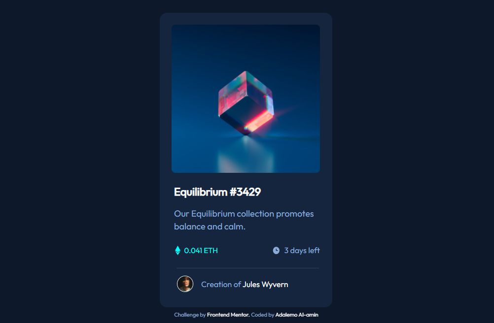

## Frontend Mentor - NFT preview card component solution

This is a solution to the NFT Equilibrum preview card component challenge on Frontend Mentor. 
Frontend Mentor challenges help you improve your coding skills by building realistic projects.

## Table of contents

- [Overview](#overview)
  - [The challenge](#the-challenge)
  - [Screenshot](#screenshot)
  - [Links](#links)
- [My process](#my-process)
  - [built with](#built-with)
  - [What i learned](#what-i-learned)
- [Author](#author)
- [Acknowledgements](#acknowledgements)

## Overview

### The challenge

Users should be able to:

- View the optimal layout depending on their device's screen size.
- See hover states for interactive elements.

### Screenshot

### Links

-Live Site URL: 

## My process

### Built with

- Semantic HTML5
- CSS
- Flexbox

### What i learned

- HTML Semantics
- Image Overlay Effect
- Clamp ()

## Author

- Frontend Mentor - [@Muhdal-Amin](https://www.frontendmentor.io/profile/Muhdal-Amin)

## Acknowledgements

Special thanks to [MiguelZaga](https://www.frontendmentor.io/profile/miguelzaga) his README files helped with the image overlay effect, clamp() and semantic HTML5 markup.